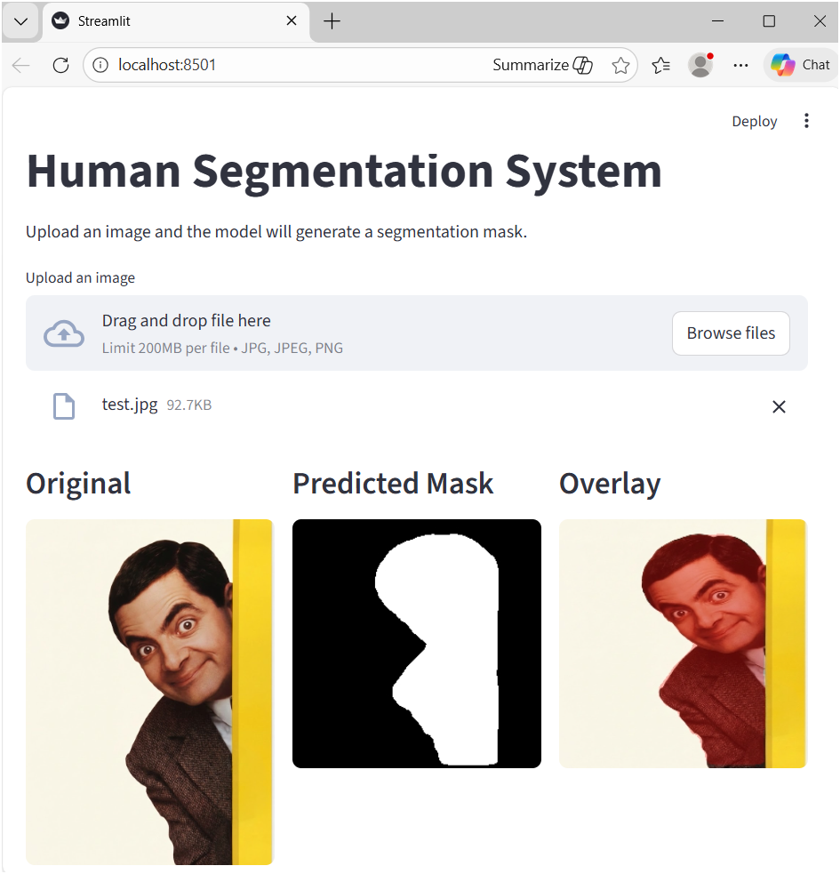
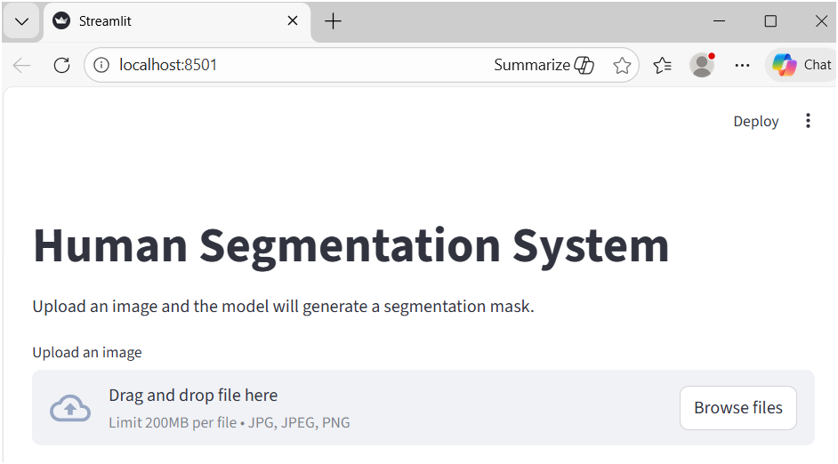

# Human Segmentation System (Deep Learning)

An end-to-end deep learning project that performs **human/person segmentation** on images and generates a **pixel-wise mask** using a CNN-based encoder–decoder architecture.  
The project also includes a **Streamlit web app** for interactive inference.

---

## Problem Statement

Automatically segmenting humans from images is an important computer vision task with applications in:
- Photo editing
- Background removal
- Content creation tools
- Computer vision pipelines

The goal of this project is to build a **semantic segmentation system** that takes an input image and outputs a **binary mask** highlighting the human region.

---

## Solution Overview

- Implemented a **CNN-based encoder–decoder (U-Net style) segmentation model**
- Used a **MobileNetV3 backbone** as the encoder for efficiency
- Built a complete **inference pipeline** to preprocess images and generate masks
- Exported the trained model in modern **Keras `.keras` format** for stable loading
- Developed a **Streamlit web app** to upload images and visualize predictions
- The system outputs:
  - Original image
  - Predicted segmentation mask
  - Overlay visualization

---

## Model Architecture

- Encoder–Decoder (U-Net style)
- Encoder: MobileNetV3 (pretrained on ImageNet)
- Decoder: Convolution + upsampling blocks with skip connections
- Output: 1-channel binary mask with sigmoid activation
- Trained for binary human/person segmentation

---

## Tech Stack

- Python  
- TensorFlow / Keras  
- OpenCV  
- NumPy  
- Streamlit  
- Google Colab (for training)  

---

## Training

The model was trained using Google Colab for faster GPU training

A human/person segmentation dataset was used

The final trained model is exported in .keras format and placed in weights/

---

## Run the Streamlit Web App
streamlit run app.py

### Streamlit App Interface

Upload any image

The app will display:
    -Original image
    -Predicted mask
    -Overlay visualization

---

## Results

The system generates a pixel-wise segmentation mask for the input image, which can be visualized directly or overlaid on the original image using the Streamlit app.

### Segmentation Result Example
